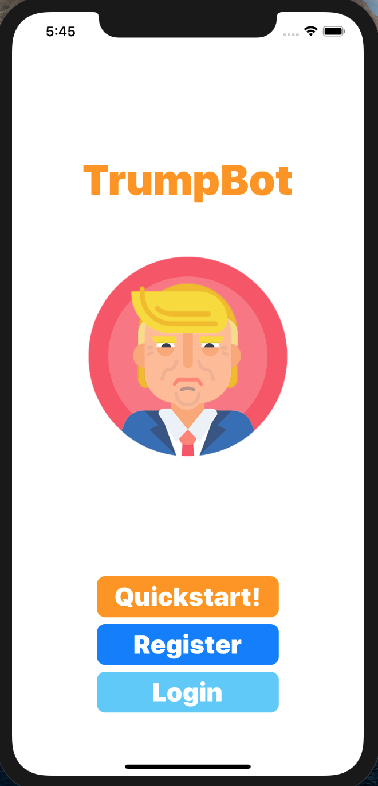
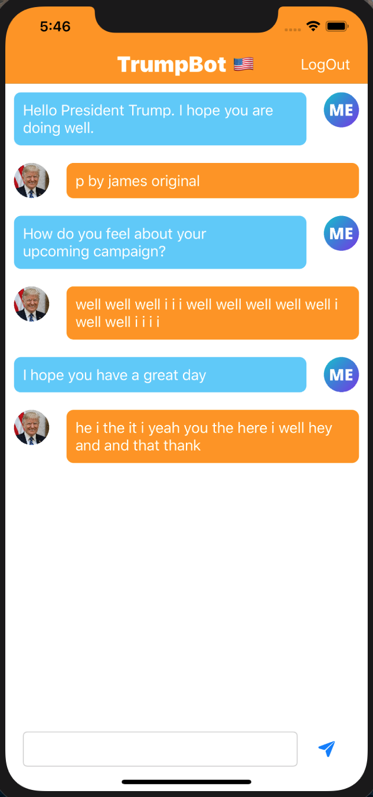
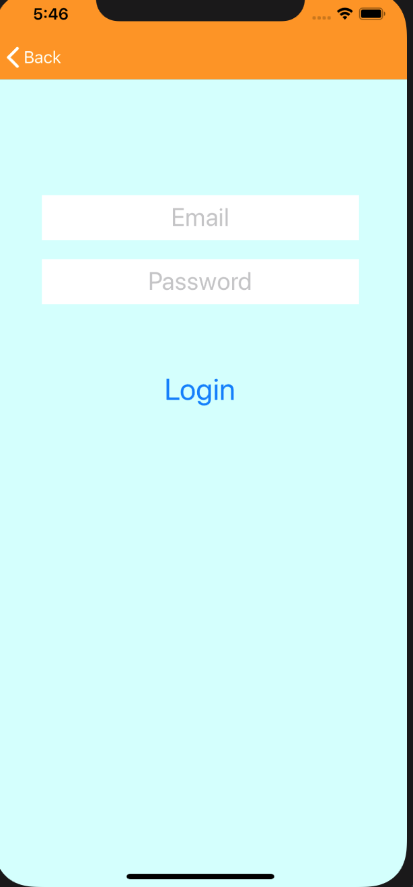
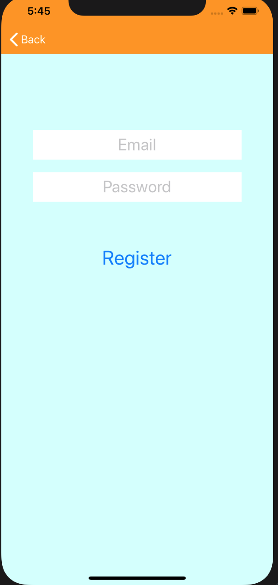

# TrumpBot: A ChatBot Trained From Donald Trump Corpora

## Work in Progress

|         Welcome Screen         |         Queried Chat Screen         |
| :----------------------------: | :-------------------------: |

|  |  |

|         Login Screen         |         Register Screen         |
| :----------------------------: | :-------------------------: |
|  |  |

## TODO

- [x] Scrape transcripts of Donald Trump
- [x] Set up local flask server
- [x] Set up app structure
- [x] Set up networking between app and server
- [] Train GPT2 model
- [] Make server return trained model's outputs
- [] Host server on GCP or some other platform

## NOTE

- The server currently just returns the same string on a port.
- The two corpora (interview and remarks) contain transcripts between Donald Trump
  and a third party. Each line contains the body of text spoken by one party.
- Each line is formatted as <"NAME"> <"SENTIMENT"> <"TEXT">
- (We can ignore the sentiment tag for now, and just train the model on all of it.)
- The party for each line does not always alternate. Sometimes donald trump speaks
  successively in multiple lines and the same is true for the other party. This is much
  more frequent in the remarks corpus, as it is not an interview but still includes third parties.
- Therefore, when training the model, it may be a good idea to only select pairs of lines where the
  third-party (i.e interviewer) speaks right before Trump does.
